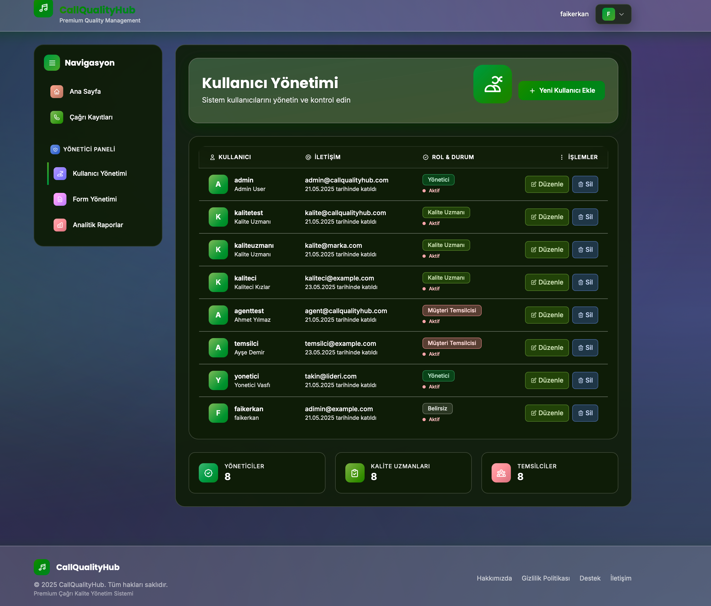

# 🎯 CallQualityHub - Premium Çağrı Merkezi Kalite Yönetim Sistemi

[](https://djangoproject.com/)
[](https://python.org/)
[](https://postgresql.org/)
[](https://tailwindcss.com/)
[](LICENSE)

**CallQualityHub**, çağrı merkezi operasyonlarında kalite değerlendirme süreçlerini web tabanlı ve dinamik şekilde yönetmek için geliştirilmiş modern bir uygulamadır. Premium tasarımı, glassmorphism efektleri ve gelişmiş animasyonları ile 2025 standartlarına uygun profesyonel bir deneyim sunar.


## ✨ Öne Çıkan Özellikler

### 🔐 **Rol Tabanlı Güvenlik Sistemi**
- **Yönetici**: Tüm sistem yönetimi ve kullanıcı kontrolü
- **Kalite Uzmanı**: Değerlendirme formları ve kalite kontrol
- **Müşteri Temsilcisi**: Kişisel performans görüntüleme

### 📊 **Dinamik Değerlendirme Sistemi**
- Özelleştirilebilir değerlendirme formları
- JSON tabanlı esnek puanlama sistemi
- Gerçek zamanlı performans takibi
- Detaylı analitik raporlar

### 🎨 **Premium Kullanıcı Arayüzü**
- Modern glassmorphism tasarım sistemi
- Smooth animasyonlar ve hover efektleri
- Responsive tasarım (mobil uyumlu)
- Dark theme ve professional color palette

### 🔊 **Medya Yönetimi**
- Çağrı kayıtlarının güvenli yüklenmesi
- Audio player entegrasyonu
- Dosya yönetimi ve arşivleme

### 📈 **Analytics & Reporting**
- Gerçek zamanlı istatistikler
- Performance tracking
- Trend analizi
- Export fonksiyonları

## 🏗️ Teknoloji Stack

| Kategori | Teknoloji |
|----------|-----------|
| **Backend** | Django 4.2, Django REST Framework |
| **Frontend** | Django Templates, TailwindCSS 3.0 |
| **Database** | PostgreSQL 15+ |
| **Authentication** | Django Auth, Role-based permissions |
| **UI/UX** | Glassmorphism, CSS Animations, Inter & Poppins fonts |
| **Deployment** | Gunicorn, Nginx, WhiteNoise |

## 🚀 Hızlı Başlangıç

### Ön Gereksinimler

```bash
# Gerekli yazılımlar
Python 3.8+
PostgreSQL 15+
Node.js 16+ (TailwindCSS için)
```

### 1️⃣ Kurulum

```bash
# Repository'yi klonlayın
git clone https://github.com/username/callqualityhub.git
cd callqualityhub

# Sanal ortam oluşturun
python -m venv .venv
source .venv/bin/activate  # Linux/Mac
# .venv\Scripts\activate  # Windows

# Bağımlılıkları yükleyin
pip install -r requirements.txt
```

### 2️⃣ Veritabanı Kurulumu

```sql
-- PostgreSQL'e bağlanın ve şu komutları çalıştırın:
CREATE DATABASE qualityhub;
CREATE USER qualityhubuser WITH PASSWORD 'qualityhub123';
ALTER ROLE qualityhubuser SET client_encoding TO 'utf8';
ALTER ROLE qualityhubuser SET default_transaction_isolation TO 'read committed';
ALTER ROLE qualityhubuser SET timezone TO 'Europe/Istanbul';
GRANT ALL PRIVILEGES ON DATABASE qualityhub TO qualityhubuser;
```

### 3️⃣ Konfigürasyon

```bash
# Environment dosyasını oluşturun
cp .env-sample .env

# .env dosyasını düzenleyin (veritabanı bilgileri vs.)
nano .env
```

### 4️⃣ Django Setup

```bash
# Migrasyonları uygulayın
python manage.py migrate

# Süper kullanıcı oluşturun
python manage.py createsuperuser

# TailwindCSS kurulumu
python manage.py tailwind install

# Statik dosyaları toplayın
python manage.py collectstatic --noinput
```

### 5️⃣ Sunucuyu Başlatın

```bash
# Geliştirme sunucusu
python manage.py runserver

# TailwindCSS watch (ayrı terminal)
python manage.py tailwind start
```

🎉 **Hazır!** `http://localhost:8000` adresinden uygulamaya erişebilirsiniz.

## 📱 Ekran Görüntüleri

### Dashboard


### Login Page


### User Management


### Call Evaluation


## 🔧 Geliştirici Kılavuzu

### Proje Yapısı

```
callqualityhub/
├── accounts/           # Kullanıcı yönetimi
├── calls/             # Çağrı kayıtları ve değerlendirme
├── dashboard/         # Dashboard views
├── api/              # REST API endpoints
├── templates/        # Django templates
├── static/          # Statik dosyalar
├── media/           # Kullanıcı yükleme dosyaları
├── tests/           # Test dosyaları
└── docs/            # Dokümantasyon
```

### API Endpoints

```bash
# Kullanıcı yönetimi
GET    /api/users/
POST   /api/users/
GET    /api/users/{id}/

# Çağrı yönetimi
GET    /api/calls/
POST   /api/calls/
GET    /api/calls/{id}/

# Değerlendirme formları
GET    /api/evaluation-forms/
POST   /api/evaluation-forms/
```

### Test Çalıştırma

```bash
# Tüm testleri çalıştır
pytest

# Django testleri
python manage.py test

# Coverage raporu
pytest --cov=.
```

## 🏭 Production Deployment

### Docker ile Deployment

```bash
# Docker imajı oluştur
docker build -t callqualityhub .

# Docker Compose ile çalıştır
docker-compose up -d
```

### Manual Deployment (Ubuntu/Debian)

```bash
# Sistem güncellemesi
sudo apt update && sudo apt upgrade -y

# Gerekli paketler
sudo apt install python3-venv python3-dev libpq-dev postgresql postgresql-contrib nginx

# Proje deployment
git clone https://github.com/username/callqualityhub.git /var/www/callqualityhub
cd /var/www/callqualityhub

# Production kurulumu
python3 -m venv venv
source venv/bin/activate
pip install -r requirements.txt

# Production ayarları
cp .env-sample .env
# .env dosyasını production değerleri ile düzenleyin

# Statik dosyalar ve migrasyonlar
python manage.py collectstatic --noinput
python manage.py migrate

# Gunicorn ve Nginx konfigürasyonu
# (Detaylı kılavuz için docs/deployment.md dosyasına bakın)
```

## 🧪 Testing

Proje kapsamlı test coverage'ına sahiptir:

```bash
# Unit testler
python manage.py test accounts
python manage.py test calls
python manage.py test dashboard

# Integration testler
pytest tests/integration/

# End-to-end testler
pytest tests/e2e/
```

## 🔒 Güvenlik

- CSRF koruması aktif
- SQL Injection koruması
- XSS koruması
- Rol tabanlı erişim kontrolü
- Secure headers (production)
- Rate limiting

## 📈 Performance

- Database query optimization
- Static file compression
- CDN ready
- Caching system
- Lazy loading

## 🤝 Katkıda Bulunma

1. Fork edin
2. Feature branch oluşturun: `git checkout -b feature/amazing-feature`
3. Değişikliklerinizi commit edin: `git commit -m 'feat: add amazing feature'`
4. Branch'inizi push edin: `git push origin feature/amazing-feature`
5. Pull Request oluşturun

### Katkı Kuralları

- Code style: PEP 8
- Commit messages: Conventional Commits
- Test coverage: minimum %80
- Dokümantasyon güncellemesi gerekli

## 📋 Roadmap

- [ ] **v2.0** - Real-time notifications
- [ ] **v2.1** - Advanced reporting dashboard
- [ ] **v2.2** - Mobile app
- [ ] **v2.3** - AI-powered quality scoring
- [ ] **v2.4** - Multi-language support

## 📞 Destek & İletişim

- **Documentation**: [Wiki](https://github.com/username/callqualityhub/wiki)
- **Issues**: [GitHub Issues](https://github.com/username/callqualityhub/issues)
- **Discussions**: [GitHub Discussions](https://github.com/username/callqualityhub/discussions)
- **Email**: admin@callqualityhub.com

## 📄 Lisans

Bu proje [MIT Lisansı](LICENSE) altında lisanslanmıştır. Detaylar için LICENSE dosyasına bakın.

## 🙏 Teşekkürler

Bu projeyi mümkün kılan harika açık kaynak projelere teşekkürler:

- [Django](https://djangoproject.com/) - Web framework
- [TailwindCSS](https://tailwindcss.com/) - CSS framework
- [PostgreSQL](https://postgresql.org/) - Database
- [Heroicons](https://heroicons.com/) - SVG icons

---

<div align="center">

**CallQualityHub ile çağrı merkezi kalite yönetimini bir üst seviyeye taşıyın! 🚀**

[⭐ Star](https://github.com/username/callqualityhub) | [🐛 Report Bug](https://github.com/username/callqualityhub/issues) | [💡 Request Feature](https://github.com/username/callqualityhub/issues)

</div> 